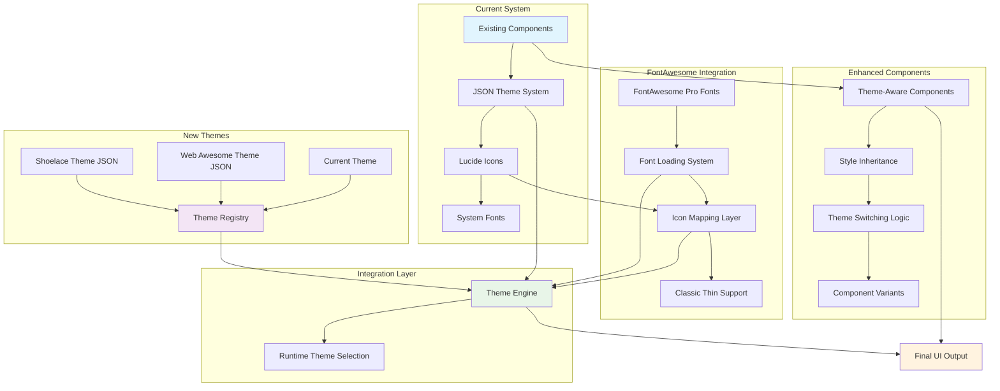
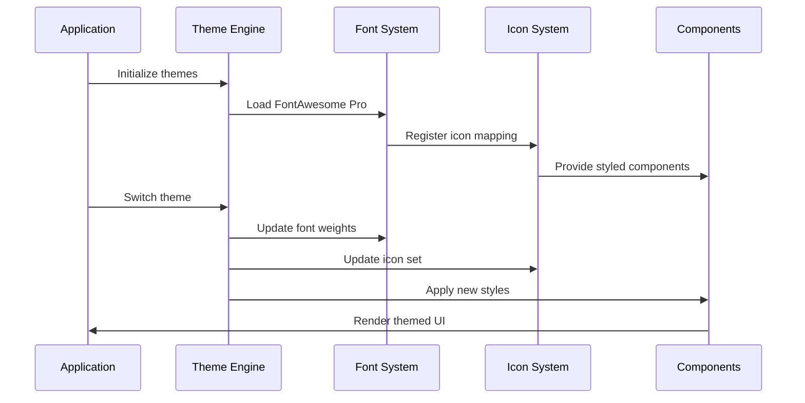
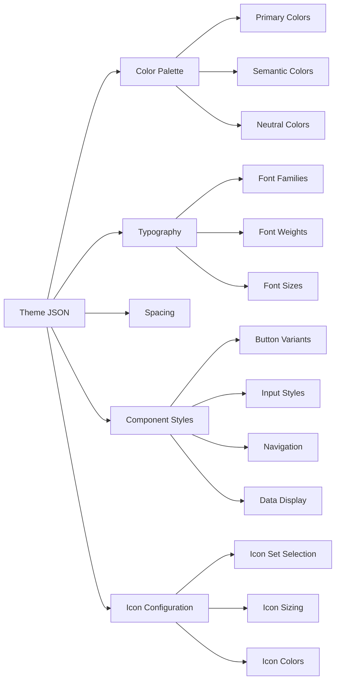
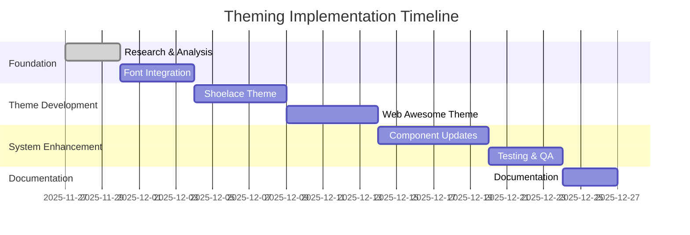
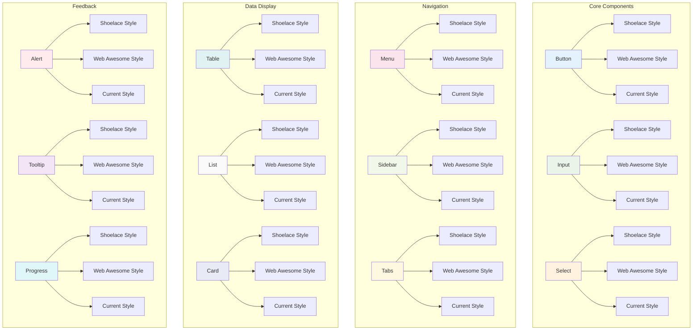

# Theming Architecture Overview

## System Architecture

## Component Flow

## Theme Structure

## Implementation Phases

## Component Coverage Matrix

This architecture ensures:
- **Consistency**: Unified theming system across all components
- **Flexibility**: Easy switching between themes
- **Maintainability**: Centralized theme management
- **Performance**: Optimized font and icon loading
- **Scalability**: Easy addition of new themes in the future